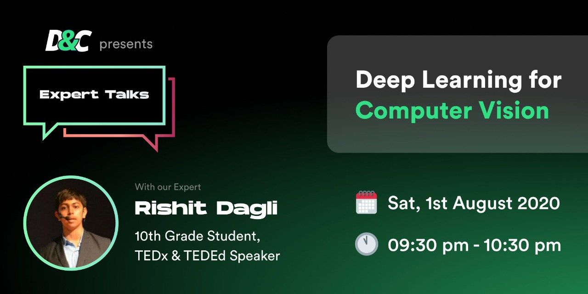

# Design-and-Code-2020 

My session at [Design and Code](https://twitter.com/design_n_code) about **Deep learning, Computer Vision with TensorFLow**, 1 August 2020. Special thanks to 
[Parth Doshi](https://www.linkedin.com/in/parth-doshi-b68575192/) and [Raj Dedania](https://www.linkedin.com/in/dedaniaraj/) for hosting me.

  

Thanks to the awesome team that made this possible
    

  
  **Management**
  
*   [Parth Doshi](https://www.linkedin.com/in/parth-doshi-b68575192/)
*   [Raj Dedania](https://www.linkedin.com/in/dedaniaraj/)

**Marketing**

*   [Siddhant Sharma](https://www.linkedin.com/in/siddhant-sharma-24a399151/)
*   [Raj Dedania](https://www.linkedin.com/in/dedaniaraj/) 

**Speaker Hunt & Co-ordination**

*   [Jeetesh Singh](https://www.linkedin.com/in/jeetesh-singh-20091999/)
*   [Parth Doshi](https://www.linkedin.com/in/parth-doshi-b68575192/)
*   [Raju Potharaju](https://www.linkedin.com/in/rajupotharaju155/)

**Design Team**

*   [Raj Dedania](https://www.linkedin.com/in/dedaniaraj/)

**Supporting Team**

*   [Krunal Gediya](https://www.linkedin.com/in/krunal-gediya/)
*   [Raj Vaya](https://www.linkedin.com/in/vayaraj/)
*   [Abhijeet Nandvikar](https://www.linkedin.com/in/abhijeet-nandvikar-724b7818b/)
*   [Mohit Belokar](https://www.linkedin.com/in/mohitbelokar/)
*   [Nidhi Tiwari](https://www.linkedin.com/in/nidhi-tiwari-2778a0b6/)
*   [Akshay Agrawal](https://www.linkedin.com/in/axay/)
*   [Hriday Hegde](https://www.linkedin.com/in/hridayhegde/)
*   [Harshal Bhatia](https://www.linkedin.com/in/harshal-bhatia/)
*   [Aniruddh Kubal](https://www.linkedin.com/in/aniruddh-kubal-8081b2180/)

## [Tweet](https://twitter.com/design_n_code/status/1288506871494500353?s=20)

## [Registration Link](https://bit.ly/cv-with-tf)

## [LiveStream URL](https://www.youtube.com/watch?v=8c7i5_A9kxA)

